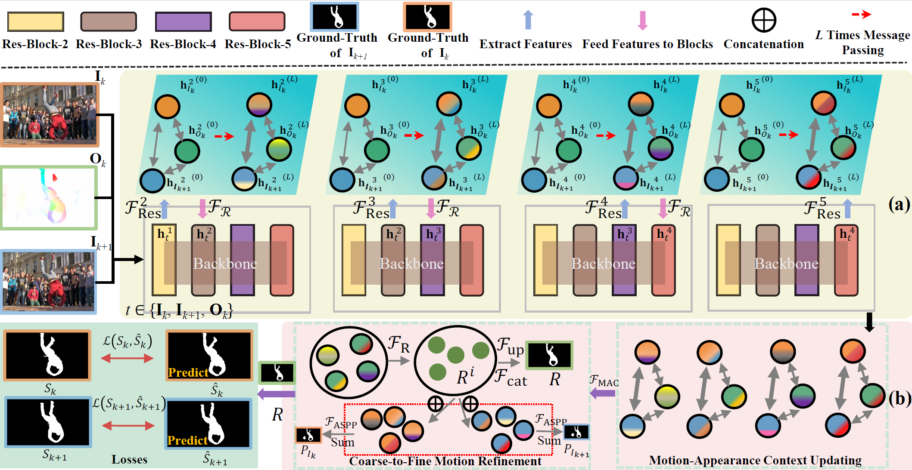

## HGPU
Code for paper: Hierarchical Graph Pattern Understanding for Zero-Shot Video Object Segmentation


<center>Figure 1. Architecture of HGPU. Frames (I_k, I_{k+1}) and their corresponding optical flow (O_k) are used as inputs to generate high-order feature representations with multiple modalities by (a) HGPE. Motion-appearance features are parsed through (b) MAUD to output coarse-to-fine segmentation results.</center>

## Requirements
- Python (3.6.12)

- PyTorch (version:1.7.0) 

- Apex (https://github.com/NVIDIA/apex, version: 0.1) 
  
- Requirements in the requirements.txt files.


## Training
### Download Datasets
1. Download the DAVIS-2017 dataset from [DAVIS](https://data.vision.ee.ethz.ch/csergi/share/davis/DAVIS-2017-trainval-480p.zip).
2. Download the YouTube-VOS dataset from [YouTube-VOS](https://youtube-vos.org/dataset/), the validation set is not mandatory to download.
3. Download the [YouTube2018-hed](https://drive.google.com/file/d/1ghq5K3FPSgZUQVNlOAGmoFY1z9QGaLu2/view?usp=sharing) and [davis-hed](https://drive.google.com/file/d/1iDcImCHORRRA1R925vJyj3xtX6Xi6gu_/view?usp=sharing) datasets.
4. The optical flow files are obtained by [RAFT](https://github.com/princeton-vl/RAFT), we provide demo code that can be run directly on path ```flow```.
We also provide optical flow of YouTube-VOS (18G) in [GoogleDrive](https://drive.google.com/file/d/1VentXMO7GWEmVhCm-nfJljZo13rLpa0L/view?usp=sharing), 
   optical flow of DAVIS can be found in [GoogleDrive](https://drive.google.com/file/d/1P-hhmblPVtiX3KILm-NK5s7ePjFIxpPZ/view?usp=sharing).
### Dataset Format
Please ensure the datasets are organized as following format. 
```
YouTube-VOS
|----train
      |----Annotations
      |----JPEGImages
      |----YouTube-flow
      |----YouTube-hed
      |----meta.json
```

```
DAVIS
      |----Annotations
      |----ImageSets
      |----JPEGImages
      |----davis-flow
      |----davis-hed
```
### Run train.py
We provide multi-GPU parallel code based on [apex](https://github.com/NVIDIA/apex).
Run ```CUDA_VISIBLE_DEVICES="0,1,2,3" python -m torch.distributed.launch --nproc_per_node 4 train_HGPU.py``` for distributed training in Pytorch.

### Note: 
Please change your dada path in two codes (```libs/utils/config_davis.py``` in line 52, and ```libs/utils/config_youtubevos.py``` in line 38)

## Testing & Results
If you want to test the model results directly, you can follow the settings below.
1. Pre-trained models and pre-calculated results.

<table>
<caption>Table 1. A list of available pre-trained models and pre-calculated results.</caption>
	<tr>
	    <th>Dataset</th>
	    <th>J Mean</th>
        <th>Pre-trained Model</th>  
        <th>Pre-calculated Mask</th>
	</tr>
     <tr>
	    <td>DAVIS-16</td>
	    <td>86.0 full-training; 78.6 pre-training; 80.3 main-training</td>
	    <td> 
        [<a href="https://drive.google.com/file/d/1ohU9sTa8UP5rE_rXF4ZXaTdH7hkyNBuj/view?usp=sharing" target="_blank">full-training</a>];
        [<a href="https://drive.google.com/file/d/1tiJq9JfmHGM72ylQTZIimywY9_ZBBvDB/view?usp=sharing" target="_blank">pre-training</a>];
        [<a href="https://drive.google.com/file/d/1YCC54V3_dczfVAHaGqD9QNMsMCJp4ut0/view?usp=sharing" target="_blank">main-training</a>]
        </td>
        <td>[<a href="https://drive.google.com/file/d/17IeWxN9P0ePdSETXoI8FaOkuc4T_SaGL/view?usp=sharing" target="_blank">DAVIS-16</a>]</td>
	</tr>
     <tr>
	    <td>Youtube-Objects</td>
	    <td>73.9 (average 10 category levels)</td>
	    <td>
        without fine-tuning
        </td>
        <td>[<a href="https://drive.google.com/file/d/1N1eepTnyIyeTsF-bowUw1O0Gv1TvXOag/view?usp=sharing" target="_blank">YouTube-Objects</a>]</td>
	</tr>
     <tr>
	    <td>Long-Videos</td>
	    <td>74.0</td>
	    <td>
        without fine-tuning
        </td>
        <td>[<a href="https://drive.google.com/file/d/1wDHxPf1UV88AKYEEoEwX_YY28tkUNHca/view?usp=sharing" target="_blank">Long-Videos</a>]</td>
	</tr>
     <tr>
	    <td>DAVIS-17</td>
	    <td>67.0</td>
	    <td>
        [<a href="https://drive.google.com/file/d/1pAYArJx5sJxJ_d8KIcaB_IxYR6zP2Gfv/view?usp=sharing" target="_blank">DAVIS-17</a>]</td>
        </td>
        <td>[<a href="https://drive.google.com/file/d/1uMM7MDjSbS0jlWp2fatOHznpGs99CZeU/view?usp=sharing" target="_blank">DAVIS-17</a>]</td>
	</tr>
</table>

2. Change your path in ```test_HGPU.py```, then run ```python test_HGPU.py```.

3. Run ```python apply_densecrf_davis.py``` (change your path in line 16) for getting binary masks.

The code directory structure is as follows.
```
  HGPU
  |----flow
  |----libs
  |----model
     |----HGPU
        |----encoder_0.8394088008745166.pt
        |----decoder_0.8394088008745166.pt
        |....
  |----apply_densecrf_davis.py
  |----train_HGPU.py
  |----test_HGPU.py
```

4. Evaluation code from [DAVIS_Evaluation](https://github.com/davisvideochallenge/davis-matlab/tree/davis-2016), the python version is available at [PyDavis16EvalToolbox](https://github.com/lartpang/PyDavis16EvalToolbox).

5. The YouTube-Objects dataset can be downloaded from [here](http://calvin-vision.net/datasets/youtube-objects-dataset/) and annotation can be found [here](http://vision.cs.utexas.edu/projects/videoseg/data_download_register.html).

6. The Long-Videos dataset can be downloaded from [here](https://www.kaggle.com/gvclsu/long-videos).

## Supplementary 

1. [PWCNet](https://github.com/sniklaus/pytorch-pwc) is used to compute optical flow estimation for HGPU training, and the pre-trained model and inference results are in [here](https://drive.google.com/file/d/14p6g5n116_Cr9gZBRsXhHe76fDD55DH8/view?usp=sharing).

## Acknowledge

1. Zero-shot Video Object Segmentation via Attentive Graph Neural Networks, ICCV 2019 (https://github.com/carrierlxk/AGNN)
2. Motion-Attentive Transition for Zero-Shot Video Object Segmentation, AAAI 2020 (https://github.com/tfzhou/MATNet)
3. Video Object Segmentation Using Space-Time Memory Networks, ICCV 2019 (https://github.com/seoungwugoh/STM)
4. Video Object Segmentation with Adaptive Feature Bank and Uncertain-Region Refinement, NeurIPS 2020 (https://github.com/xmlyqing00/AFB-URR)
